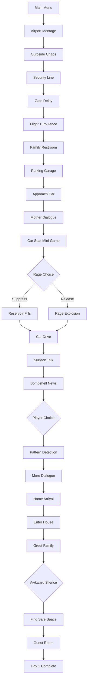

# Scene Architecture & Implementation Guide
## Rando's Reservoir - Detailed Scene Blueprints

### Document Version: 1.0.0
### Date: January 2025

---

## 1. Scene Architecture Philosophy

### 1.1 Core Principles

#### Separation of Concerns
Each scene component has a single, well-defined responsibility:
- **Controller**: Manages scene flow and state
- **View**: Handles visual presentation
- **Logic**: Processes game mechanics
- **Data**: Stores scene-specific information

#### Modularity
Scenes are built from reusable components:
- State machines for behavior management
- UI components for consistent interface elements
- Dialogue systems for conversation handling
- Effect systems for visual/audio feedback

#### Communication Patterns
- **Signals**: For decoupled communication between systems
- **Event Bus**: For global events that affect multiple systems
- **Direct References**: Only for tightly coupled parent-child relationships

---

## 2. Airport Montage Architecture

### 2.1 Scene Structure

```
/airport_montage/
├── montage_controller.tscn
│   ├── MontageController (Node)
│   ├── StateMachine (Node)
│   │   ├── LoadingState
│   │   ├── VignetteState
│   │   ├── TransitionState
│   │   └── CompleteState
│   ├── VignetteManager (Node)
│   │   ├── VignetteQueue
│   │   └── CurrentVignette
│   ├── UI (CanvasLayer)
│   │   ├── RageMeter
│   │   ├── VignetteTitle
│   │   └── SkipPrompt
│   └── TransitionEffects (Node2D)
│       ├── FadeOverlay
│       └── TextOverlay
```

### 2.2 Vignette Base Class

```gdscript
# vignette_base.gd
class_name VignetteBase
extends Node2D

signal vignette_completed()
signal rage_generated(amount: float)

@export var vignette_name: String = ""
@export var duration: float = 5.0
@export var base_rage_amount: float = 5.0
@export var has_interaction: bool = false

var time_elapsed: float = 0.0
var is_active: bool = false

func start_vignette():
    is_active = true
    _on_vignette_start()
    
    if has_interaction:
        _setup_interaction()
    else:
        _start_timer()

func _on_vignette_start():
    # Override in child classes
    pass

func _setup_interaction():
    # Override for interactive vignettes
    pass

func _start_timer():
    var timer = Timer.new()
    timer.wait_time = duration
    timer.one_shot = true
    timer.timeout.connect(_on_timer_complete)
    add_child(timer)
    timer.start()

func _on_timer_complete():
    complete_vignette()

func complete_vignette(success: bool = true):
    if not success:
        rage_generated.emit(base_rage_amount * 1.5)
    else:
        rage_generated.emit(base_rage_amount)
    
    is_active = false
    vignette_completed.emit()
```

### 2.3 Specific Vignette: Curbside Chaos

```gdscript
# curbside_chaos.gd
extends VignetteBase

@onready var luggage_pile = $LuggagePile
@onready var balance_indicator = $BalanceIndicator
@onready var click_zones = $ClickZones

var balance_value: float = 50.0
var balance_decay_rate: float = 10.0
var clicks_required: int = 5
var clicks_completed: int = 0

func _on_vignette_start():
    vignette_name = "Curbside Chaos"
    base_rage_amount = 5.0
    has_interaction = true
    
    # Show internal monologue
    show_monologue("Just get inside. Just get inside.")

func _setup_interaction():
    # Enable click zones
    for zone in click_zones.get_children():
        zone.input_event.connect(_on_zone_clicked)
        zone.visible = true
    
    # Start balance decay
    set_process(true)

func _process(delta):
    if is_active:
        # Decay balance
        balance_value -= balance_decay_rate * delta
        balance_indicator.value = balance_value
        
        # Check failure condition
        if balance_value <= 0:
            _on_balance_failed()

func _on_zone_clicked(viewport, event, shape_idx):
    if event is InputEventMouseButton and event.pressed:
        clicks_completed += 1
        balance_value = min(balance_value + 20, 100)
        
        # Visual feedback
        create_click_feedback(event.position)
        
        if clicks_completed >= clicks_required:
            complete_vignette(true)

func _on_balance_failed():
    complete_vignette(false)
    show_monologue("Everything's falling apart already...")
```

### 2.4 Montage Controller

```gdscript
# montage_controller.gd
extends Node

@onready var state_machine = $StateMachine
@onready var vignette_manager = $VignetteManager
@onready var rage_meter = $UI/RageMeter
@onready var transition_effects = $TransitionEffects

# Vignette scenes
var vignette_scenes = [
    preload("res://src/scenes/day1/airport_montage/vignettes/curbside_chaos.tscn"),
    preload("res://src/scenes/day1/airport_montage/vignettes/security_line.tscn"),
    preload("res://src/scenes/day1/airport_montage/vignettes/gate_delay.tscn"),
    preload("res://src/scenes/day1/airport_montage/vignettes/flight_turbulence.tscn"),
    preload("res://src/scenes/day1/airport_montage/vignettes/family_restroom.tscn")
]

var current_vignette_index: int = 0
var accumulated_rage: float = 0.0

func _ready():
    # Initialize rage at 0 for montage
    rage_meter.set_value(0)
    
    # Connect signals
    EventBus.rage_updated.connect(_on_rage_updated)
    
    # Start montage
    state_machine.transition_to("loading")
    _load_first_vignette()

func _load_first_vignette():
    await get_tree().create_timer(1.0).timeout
    state_machine.transition_to("vignette")
    play_next_vignette()

func play_next_vignette():
    if current_vignette_index >= vignette_scenes.size():
        complete_montage()
        return
    
    # Instantiate vignette
    var vignette = vignette_scenes[current_vignette_index].instantiate()
    vignette_manager.add_child(vignette)
    
    # Connect signals
    vignette.vignette_completed.connect(_on_vignette_completed)
    vignette.rage_generated.connect(_on_rage_generated)
    
    # Start vignette
    vignette.start_vignette()
    current_vignette_index += 1

func _on_vignette_completed():
    # Transition to next vignette
    state_machine.transition_to("transition")
    
    # Clean up current vignette
    for child in vignette_manager.get_children():
        child.queue_free()
    
    # Show transition
    await show_transition()
    
    # Load next vignette
    state_machine.transition_to("vignette")
    play_next_vignette()

func _on_rage_generated(amount: float):
    accumulated_rage += amount
    GameManager.emotional_state.increase_rage(amount)
    rage_meter.animate_increase(amount)

func show_transition():
    transition_effects.get_node("FadeOverlay").fade_in()
    await get_tree().create_timer(0.5).timeout
    transition_effects.get_node("FadeOverlay").fade_out()

func complete_montage():
    state_machine.transition_to("complete")
    
    # Show final text
    var text_overlay = transition_effects.get_node("TextOverlay")
    text_overlay.show_text("Her mom couldn't make it.")
    await get_tree().create_timer(3.0).timeout
    
    text_overlay.show_text("OCALA, FLORIDA")
    await get_tree().create_timer(2.0).timeout
    
    # Transition to next scene
    SceneManager.change_scene("parking_garage")
```

---

## 3. Parking Garage Scene Architecture

### 3.1 Scene Structure

```
/parking_garage/
├── parking_garage.tscn
│   ├── Environment (Node2D)
│   │   ├── Background
│   │   ├── Car
│   │   ├── HeatHaze (Shader)
│   │   └── LightingEffects
│   ├── Characters (Node2D)
│   │   ├── Player
│   │   ├── Mother
│   │   └── BabyCarrier
│   ├── GameLogic (Node)
│   │   ├── StateMachine
│   │   │   ├── ApproachState
│   │   │   ├── DialogueState
│   │   │   ├── MiniGameState
│   │   │   └── ResolutionState
│   │   ├── MiniGameController
│   │   └── SuppressionSystem
│   ├── UI (CanvasLayer)
│   │   ├── HUD
│   │   │   ├── RageMeter
│   │   │   ├── HeatMeter
│   │   │   └── FussMeter
│   │   ├── DialogueBox
│   │   └── SuppressionPrompt
│   └── Audio (Node)
│       ├── AmbientSounds
│       └── EffectSounds
```

### 3.2 Car Seat Mini-Game

```gdscript
# car_seat_minigame.gd
extends Node2D

signal puzzle_attempt(success: bool)
signal puzzle_completed()

@onready var car_seat_visual = $CarSeatVisual
@onready var strap_left = $Straps/Left
@onready var strap_right = $Straps/Right
@onready var buckle_center = $Buckle
@onready var error_indicator = $ErrorIndicator

# Puzzle configuration
var correct_sequence = ["strap_left", "buckle_center", "strap_right"]
var current_sequence = []
var failure_count = 0
var max_failures = 3

# Difficulty modifiers
var base_time_limit = 10.0
var time_remaining = 0.0
var difficulty_modifier = 1.0

func start_minigame():
    reset_puzzle()
    set_process(true)
    
    # Calculate difficulty based on rage
    difficulty_modifier = 1.0 + (GameManager.emotional_state.rage_level * 0.01)
    time_remaining = base_time_limit / difficulty_modifier

func _process(delta):
    if time_remaining > 0:
        time_remaining -= delta
        
        # Update visual timer if exists
        if has_node("TimerBar"):
            $TimerBar.value = (time_remaining / base_time_limit) * 100
        
        if time_remaining <= 0:
            _on_timeout()

func _on_part_clicked(part_name: String):
    current_sequence.append(part_name)
    
    # Visual feedback
    get_node("Straps/" + part_name).modulate = Color.GREEN
    AudioManager.play_sfx("click_mechanical")
    
    # Check if sequence is complete
    if current_sequence.size() == correct_sequence.size():
        check_solution()

func check_solution():
    if current_sequence == correct_sequence:
        # Success!
        puzzle_attempt.emit(true)
        complete_puzzle()
    else:
        # Failure
        failure_count += 1
        puzzle_attempt.emit(false)
        show_failure_feedback()
        
        if failure_count >= max_failures:
            trigger_rage_choice()
        else:
            reset_puzzle()

func show_failure_feedback():
    error_indicator.visible = true
    error_indicator.modulate = Color.RED
    
    # Screen shake
    var camera = get_viewport().get_camera_2d()
    if camera:
        shake_camera(camera, 0.5, 10)
    
    # Sound
    AudioManager.play_sfx("error_harsh")
    
    # Rage increase
    GameManager.emotional_state.increase_rage(10.0 * failure_count)
    
    await get_tree().create_timer(1.0).timeout
    error_indicator.visible = false

func trigger_rage_choice():
    # This triggers the suppression choice
    EventBus.rage_threshold_reached.emit()
    get_parent().show_suppression_choice()

func reset_puzzle():
    current_sequence.clear()
    
    # Reset visual states
    for strap in $Straps.get_children():
        strap.modulate = Color.WHITE
    
    buckle_center.modulate = Color.WHITE
    
    # Reset timer
    time_remaining = base_time_limit / difficulty_modifier

func complete_puzzle():
    set_process(false)
    
    # Success animation
    var tween = create_tween()
    tween.tween_property(car_seat_visual, "modulate", Color.GREEN, 0.5)
    
    AudioManager.play_sfx("success_chime")
    
    await get_tree().create_timer(1.0).timeout
    puzzle_completed.emit()
```

### 3.3 Suppression System

```gdscript
# suppression_system.gd
extends Node

signal suppression_chosen(suppressed: bool)

@onready var prompt_ui = $"../UI/SuppressionPrompt"
@onready var rage_meter = $"../UI/HUD/RageMeter"
@onready var reservoir_meter = $"../UI/HUD/ReservoirMeter"

var suppression_available: bool = true
var holding_key: bool = false
var hold_duration: float = 0.0
var required_hold_time: float = 1.5

func show_suppression_choice():
    if not suppression_available:
        return
    
    # Time slows
    Engine.time_scale = 0.3
    
    # Show prompt
    prompt_ui.visible = true
    prompt_ui.get_node("Label").text = "[Hold R to Suppress]"
    
    # Enable input processing
    set_process_input(true)
    set_process(true)
    
    # Start timeout for automatic rage release
    start_timeout()

func _input(event):
    if not prompt_ui.visible:
        return
    
    if event.is_action_pressed("suppress_rage"):
        holding_key = true
        hold_duration = 0.0
        show_suppression_effect()
    
    elif event.is_action_released("suppress_rage"):
        if holding_key and hold_duration < required_hold_time:
            # Cancelled suppression
            cancel_suppression()
        holding_key = false

func _process(delta):
    if holding_key:
        hold_duration += delta
        
        # Update visual feedback
        var progress = hold_duration / required_hold_time
        prompt_ui.get_node("ProgressBar").value = progress * 100
        
        if hold_duration >= required_hold_time:
            execute_suppression()

func show_suppression_effect():
    # Visual effect - dark tendrils pulling inward
    var effect = preload("res://src/effects/suppression_effect.tscn").instantiate()
    get_parent().add_child(effect)
    
    # Audio - sharp inhale
    AudioManager.play_sfx("inhale_sharp")

func execute_suppression():
    holding_key = false
    prompt_ui.visible = false
    Engine.time_scale = 1.0
    
    # Transfer rage to reservoir
    var rage_amount = GameManager.emotional_state.rage_level
    GameManager.emotional_state.suppress_rage()
    
    # Visual feedback
    rage_meter.animate_drain()
    reservoir_meter.animate_fill(rage_amount * 0.1)
    reservoir_meter.first_appearance()
    
    # Internal monologue
    show_internal_monologue("Fine. It's fine. I'm fine. Just get it done.")
    
    suppression_chosen.emit(true)
    set_process(false)
    set_process_input(false)

func cancel_suppression():
    prompt_ui.visible = false
    Engine.time_scale = 1.0
    
    # Let rage explode
    execute_rage_release()

func execute_rage_release():
    # Animation - hand slams car roof
    var player = get_node("../Characters/Player")
    player.play_animation("slam_car")
    
    # Sound
    AudioManager.play_sfx("metal_bang_loud")
    
    # Baby reaction
    var baby = get_node("../Characters/BabyCarrier")
    baby.start_crying()
    
    # Mother reaction
    var mother = get_node("../Characters/Mother")
    mother.show_reaction("startled")
    mother.say_dialogue("Rando! Oh, you've scared her. Please, just try to stay calm.")
    
    # Rage meter empties
    GameManager.emotional_state.release_rage()
    rage_meter.animate_drain()
    
    suppression_chosen.emit(false)
    set_process(false)
    set_process_input(false)

func start_timeout():
    await get_tree().create_timer(5.0).timeout
    
    if prompt_ui.visible:
        # Auto-choose rage release if no input
        cancel_suppression()
```

---

## 4. Car Drive Dialogue Architecture

### 4.1 Scene Structure

```
/car_drive/
├── car_drive.tscn
│   ├── CarInterior (Node2D)
│   │   ├── Dashboard
│   │   ├── Windows
│   │   │   ├── Windshield
│   │   │   └── SideWindows
│   │   └── PassingScenery (ParallaxBackground)
│   ├── Characters (Node2D)
│   │   ├── MotherDriver
│   │   ├── PlayerPassenger
│   │   └── BabyInBack
│   ├── DialogueSystem (Node)
│   │   ├── DialogueController
│   │   ├── DialogueTree
│   │   ├── PatternAnalyzer
│   │   └── InterruptionManager
│   ├── UI (CanvasLayer)
│   │   ├── DialogueUI
│   │   │   ├── SpeakerName
│   │   │   ├── DialogueText
│   │   │   └── ChoiceButtons
│   │   ├── PatternNotification
│   │   └── HUD
│   └── Audio (Node)
│       ├── CarAmbience
│       ├── RadioStatic
│       └── BabyNoise
```

### 4.2 Dialogue Controller

```gdscript
# dialogue_controller.gd
extends Node

signal dialogue_started(dialogue_id: String)
signal dialogue_ended()
signal choice_made(choice_data: Dictionary)

@onready var dialogue_ui = $"../UI/DialogueUI"
@onready var dialogue_tree = $DialogueTree
@onready var pattern_analyzer = $PatternAnalyzer
@onready var interruption_manager = $InterruptionManager

var current_dialogue: Dictionary = {}
var dialogue_history: Array = []
var conversation_active: bool = false

# Dialogue database
var dialogues = {}

func _ready():
    load_dialogue_database()
    
    # Connect interruption signals
    interruption_manager.interruption_triggered.connect(_on_interruption)
    
    # Start initial dialogue after delay
    await get_tree().create_timer(2.0).timeout
    start_dialogue("car_drive_intro")

func load_dialogue_database():
    var file = FileAccess.open("res://src/dialogue/day1/car_drive_dialogues.json", FileAccess.READ)
    if file:
        var json_string = file.get_as_text()
        file.close()
        
        var json = JSON.new()
        var parse_result = json.parse(json_string)
        if parse_result == OK:
            dialogues = json.data

func start_dialogue(dialogue_id: String):
    if not dialogue_id in dialogues:
        push_error("Dialogue not found: " + dialogue_id)
        return
    
    current_dialogue = dialogues[dialogue_id]
    conversation_active = true
    
    dialogue_started.emit(dialogue_id)
    display_dialogue()

func display_dialogue():
    # Show speaker
    dialogue_ui.get_node("SpeakerName").text = current_dialogue.speaker.capitalize()
    
    # Animate text
    var text_label = dialogue_ui.get_node("DialogueText")
    text_label.text = ""
    
    var full_text = current_dialogue.text
    var tween = create_tween()
    
    # Type out text character by character
    for i in range(full_text.length()):
        tween.tween_callback(func(): text_label.text += full_text[i])
        tween.tween_interval(0.03)
    
    await tween.finished
    
    # Show choices if available
    if "choices" in current_dialogue:
        show_choices()
    else:
        # Auto-advance after delay
        await get_tree().create_timer(3.0).timeout
        if "next" in current_dialogue:
            start_dialogue(current_dialogue.next)
        else:
            end_dialogue()

func show_choices():
    var choice_container = dialogue_ui.get_node("ChoiceButtons")
    
    # Clear existing choices
    for child in choice_container.get_children():
        child.queue_free()
    
    # Create choice buttons
    for i in range(current_dialogue.choices.size()):
        var choice = current_dialogue.choices[i]
        var button = preload("res://src/ui/dialogue/choice_button.tscn").instantiate()
        
        button.text = str(i + 1) + ". " + choice.text
        button.pressed.connect(func(): select_choice(i))
        
        choice_container.add_child(button)
        
        # Animate button appearance
        button.modulate.a = 0
        var tween = create_tween()
        tween.tween_property(button, "modulate:a", 1.0, 0.3)

func select_choice(index: int):
    var choice = current_dialogue.choices[index]
    
    # Record choice
    dialogue_history.append({
        "dialogue_id": current_dialogue.id,
        "choice_index": index,
        "pattern": choice.get("pattern", "")
    })
    
    # Analyze pattern
    if "pattern" in choice:
        pattern_analyzer.record_pattern(choice.pattern)
    
    # Apply emotional impact
    if "emotional_impact" in choice:
        var impact = choice.emotional_impact
        if "rage" in impact:
            GameManager.emotional_state.increase_rage(impact.rage)
        if "reservoir" in impact:
            GameManager.emotional_state.reservoir_level += impact.reservoir
    
    # Emit choice signal
    choice_made.emit(choice)
    
    # Clear choices
    var choice_container = dialogue_ui.get_node("ChoiceButtons")
    for child in choice_container.get_children():
        child.queue_free()
    
    # Continue to next dialogue
    if "next" in choice:
        await get_tree().create_timer(1.0).timeout
        start_dialogue(choice.next)
    else:
        end_dialogue()

func _on_interruption(interruption_type: String):
    if not conversation_active:
        return
    
    match interruption_type:
        "baby_fussing":
            # Pause current dialogue
            conversation_active = false
            
            # Show interruption
            show_internal_monologue("She's getting fussy...")
            
            # Show choice: Continue talking or soothe baby
            show_interruption_choice()

func show_interruption_choice():
    var choices = [
        {"text": "Keep talking", "action": "continue"},
        {"text": "[Reach back to soothe baby]", "action": "soothe"}
    ]
    
    # Show special choice UI
    # Implementation depends on UI design

func end_dialogue():
    conversation_active = false
    dialogue_ui.visible = false
    dialogue_ended.emit()
```

### 4.3 Pattern Analyzer

```gdscript
# pattern_analyzer.gd
extends Node

signal pattern_detected(pattern_type: String)
signal pattern_threshold_reached(pattern_type: String, count: int)

var pattern_counts: Dictionary = {}
var pattern_thresholds = {
    "PEACEMAKER": 3,
    "INTELLECTUAL": 3,
    "JUDGE": 2,
    "VULNERABLE": 2,
    "DEFLECTOR": 3
}

var pattern_descriptions = {
    "PEACEMAKER": "Always keeping the peace",
    "INTELLECTUAL": "Hiding behind logic",
    "JUDGE": "Quick to criticize",
    "VULNERABLE": "Opening up",
    "DEFLECTOR": "Avoiding the real issue"
}

func record_pattern(pattern_type: String):
    if not pattern_type in pattern_counts:
        pattern_counts[pattern_type] = 0
    
    pattern_counts[pattern_type] += 1
    
    # Show notification
    show_pattern_notification(pattern_type)
    
    # Check threshold
    if pattern_type in pattern_thresholds:
        if pattern_counts[pattern_type] == pattern_thresholds[pattern_type]:
            pattern_threshold_reached.emit(pattern_type, pattern_counts[pattern_type])
            trigger_pattern_consequence(pattern_type)
    
    # Record in game manager
    GameManager.player_data.add_pattern(pattern_type)
    
    pattern_detected.emit(pattern_type)

func show_pattern_notification(pattern_type: String):
    var notification = preload("res://src/ui/pattern_notification.tscn").instantiate()
    get_tree().current_scene.add_child(notification)
    
    notification.get_node("Title").text = "PATTERN: " + pattern_type
    notification.get_node("Description").text = pattern_descriptions.get(pattern_type, "")
    
    # Fade in
    notification.modulate.a = 0
    var tween = create_tween()
    tween.tween_property(notification, "modulate:a", 1.0, 0.5)
    tween.tween_interval(2.0)
    tween.tween_property(notification, "modulate:a", 0.0, 0.5)
    tween.tween_callback(notification.queue_free)

func trigger_pattern_consequence(pattern_type: String):
    match pattern_type:
        "PEACEMAKER":
            # Increase reservoir slightly - the cost of always managing others
            GameManager.emotional_state.reservoir_level += 5
            show_internal_monologue("Always smoothing things over...")
        
        "JUDGE":
            # Increase rage - judgment breeds anger
            GameManager.emotional_state.increase_rage(10)
            show_internal_monologue("Why am I always so critical?")
        
        "VULNERABLE":
            # Decrease rage slightly - genuine expression helps
            GameManager.emotional_state.rage_level = max(0, GameManager.emotional_state.rage_level - 10)
            show_internal_monologue("That actually felt good to say...")
```

---

## 5. Home Arrival Architecture

### 5.1 Scene Structure

```
/family_home/
├── home_arrival.tscn
│   ├── House (Node2D)
│   │   ├── Exterior
│   │   ├── Entryway
│   │   │   ├── ClutterObjects
│   │   │   └── DoorTrigger
│   │   ├── LivingRoom
│   │   │   ├── Couch
│   │   │   ├── TV
│   │   │   └── MoreClutter
│   │   └── GuestRoom
│   │       ├── Bed
│   │       ├── Door
│   │       └── SafeSpace
│   ├── NPCs (Node2D)
│   │   ├── Father
│   │   │   ├── Wheelchair
│   │   │   └── DialogueComponent
│   │   ├── Brother
│   │   │   ├── CouchPosition
│   │   │   └── AvoidanceComponent
│   │   └── Mother
│   ├── EnvironmentalSystems (Node)
│   │   ├── ClutterManager
│   │   ├── OverwhelmSystem
│   │   └── InteractionManager
│   ├── UI (CanvasLayer)
│   │   ├── HUD
│   │   │   ├── OverwhelmMeter
│   │   │   └── RageMeter
│   │   ├── InteractionPrompts
│   │   └── InternalMonologue
│   └── Audio (Node)
│       ├── HouseAmbience
│       └── RefrigeratorHum
```

### 5.2 Clutter & Overwhelm System

```gdscript
# clutter_manager.gd
extends Node

signal clutter_level_changed(level: float)
signal overwhelm_triggered()

@onready var overwhelm_meter = $"../UI/HUD/OverwhelmMeter"

var clutter_objects: Array = []
var base_overwhelm_rate: float = 2.0
var current_overwhelm: float = 0.0
var max_overwhelm: float = 100.0
var is_in_cluttered_area: bool = false

func _ready():
    # Find all clutter objects
    clutter_objects = get_tree().get_nodes_in_group("clutter")
    
    # Set up areas
    for area in get_tree().get_nodes_in_group("cluttered_area"):
        area.body_entered.connect(_on_entered_cluttered_area)
        area.body_exited.connect(_on_exited_cluttered_area)

func _process(delta):
    if is_in_cluttered_area:
        # Increase overwhelm based on visible clutter
        var visible_clutter = count_visible_clutter()
        var overwhelm_rate = base_overwhelm_rate * (1.0 + visible_clutter * 0.1)
        
        current_overwhelm = min(current_overwhelm + overwhelm_rate * delta, max_overwhelm)
        overwhelm_meter.value = current_overwhelm
        
        # Check threshold
        if current_overwhelm >= max_overwhelm * 0.8:
            overwhelm_triggered.emit()
            affect_rage_volatility()

func count_visible_clutter() -> int:
    var count = 0
    var camera = get_viewport().get_camera_2d()
    
    if camera:
        var viewport_rect = camera.get_viewport_rect()
        
        for obj in clutter_objects:
            if viewport_rect.has_point(obj.global_position):
                count += 1
    
    return count

func affect_rage_volatility():
    # Make rage meter more sensitive when overwhelmed
    GameManager.emotional_state.rage_level += 5
    show_internal_monologue("It's everywhere. Can't think straight...")

func _on_entered_cluttered_area(body):
    if body.is_in_group("player"):
        is_in_cluttered_area = true
        overwhelm_meter.visible = true
        overwhelm_meter.start_pulsing()

func _on_exited_cluttered_area(body):
    if body.is_in_group("player"):
        is_in_cluttered_area = false
        
        # Slowly decrease overwhelm
        var tween = create_tween()
        tween.tween_property(self, "current_overwhelm", current_overwhelm * 0.5, 2.0)
```

### 5.3 NPC Interaction System

```gdscript
# npc_interaction.gd
extends Node

@onready var father = $"../NPCs/Father"
@onready var brother = $"../NPCs/Brother"
@onready var mother = $"../NPCs/Mother"

var interaction_completed = {
    "father": false,
    "brother": false,
    "mother": false
}

func _ready():
    setup_npc_interactions()

func setup_npc_interactions():
    # Father interaction
    father.get_node("InteractionArea").body_entered.connect(
        func(body): 
            if body.is_in_group("player"):
                show_interaction_prompt("Hug Dad", father)
    )
    
    # Brother interaction
    brother.get_node("InteractionArea").body_entered.connect(
        func(body):
            if body.is_in_group("player"):
                show_interaction_prompt("Greet Brother", brother)
    )

func interact_with_father():
    if interaction_completed["father"]:
        return
    
    # Play hug animation
    var player = get_node("../Player")
    player.play_animation("hug")
    father.play_animation("receive_hug")
    
    # Internal monologue
    show_internal_monologue("He feels so fragile. Just bones.")
    
    # Father doesn't acknowledge baby
    await get_tree().create_timer(2.0).timeout
    show_internal_monologue("Not even a glance at her.")
    
    interaction_completed["father"] = true

func interact_with_brother():
    if interaction_completed["brother"]:
        return
    
    # Brother barely responds
    brother.play_animation("minimal_acknowledgment")
    
    # Internal monologue
    show_internal_monologue("No eye contact. Nothing. It's like hugging a stranger.")
    
    # No acknowledgment of baby
    await get_tree().create_timer(2.0).timeout
    
    interaction_completed["brother"] = true

func check_all_greeted():
    var all_greeted = true
    for key in interaction_completed:
        if not interaction_completed[key]:
            all_greeted = false
            break
    
    if all_greeted:
        trigger_choice_moment()

func trigger_choice_moment():
    # The awkward silence
    show_internal_monologue("The silence is deafening...")
    
    # Show choice options
    var choices = [
        {
            "text": "So! What's new? Catch me up on everything!",
            "pattern": "PEACEMAKER",
            "result": "forced_cheer"
        },
        {
            "text": "I need to find a place to set her down.",
            "pattern": "DEFLECTOR",
            "result": "logistics"
        },
        {
            "text": "Brother, can you clear a space for her play mat?",
            "pattern": "DIRECT",
            "result": "direct_request"
        }
    ]
    
    show_choice_ui(choices)
```

### 5.4 Guest Room Safe Space

```gdscript
# guest_room.gd
extends Node2D

signal safe_space_entered()
signal door_closed()

@onready var door = $Door
@onready var door_area = $DoorArea
@onready var room_ambience = $RoomAmbience

var is_door_closed: bool = false
var player_inside: bool = false

func _ready():
    door_area.body_entered.connect(_on_body_entered)
    door_area.body_exited.connect(_on_body_exited)

func _on_body_entered(body):
    if body.is_in_group("player"):
        player_inside = true
        
        if not is_door_closed:
            show_interaction_prompt("Close door")

func _on_body_exited(body):
    if body.is_in_group("player"):
        player_inside = false

func close_door():
    if not player_inside:
        return
    
    is_door_closed = true
    
    # Animate door closing
    door.play_animation("close")
    AudioManager.play_sfx("door_close_soft")
    
    # Muffle outside sounds
    var house_audio = get_node("../../Audio/HouseAmbience")
    var tween = create_tween()
    tween.tween_property(house_audio, "volume_db", -20.0, 1.0)
    
    # Start calm ambience
    room_ambience.play()
    
    # Decrease overwhelm
    var clutter_manager = get_node("../../EnvironmentalSystems/ClutterManager")
    clutter_manager.current_overwhelm = 0
    
    # Show relief
    show_internal_monologue("Finally. A moment to breathe.")
    
    # Signal safe space achieved
    safe_space_entered.emit()
    door_closed.emit()
    
    # This is a good save point
    GameManager.save_game()
```

---

## 6. Shared Components

### 6.1 Internal Monologue System

```gdscript
# internal_monologue.gd
extends CanvasLayer

@onready var text_label = $Panel/Label
@onready var panel = $Panel

var monologue_queue: Array = []
var is_showing: bool = false

func show_monologue(text: String, duration: float = 3.0):
    monologue_queue.append({"text": text, "duration": duration})
    
    if not is_showing:
        _process_queue()

func _process_queue():
    if monologue_queue.is_empty():
        is_showing = false
        return
    
    is_showing = true
    var monologue = monologue_queue.pop_front()
    
    # Style based on emotional state
    var rage_level = GameManager.emotional_state.rage_level
    if rage_level > 75:
        text_label.modulate = Color(1.0, 0.7, 0.7)  # Reddish
        text_label.add_theme_font_size_override("font_size", 18)
    elif rage_level > 50:
        text_label.modulate = Color(1.0, 0.9, 0.8)  # Yellowish
        text_label.add_theme_font_size_override("font_size", 16)
    else:
        text_label.modulate = Color.WHITE
        text_label.add_theme_font_size_override("font_size", 14)
    
    # Animate in
    text_label.text = monologue.text
    panel.modulate.a = 0
    panel.visible = true
    
    var tween = create_tween()
    tween.tween_property(panel, "modulate:a", 1.0, 0.3)
    tween.tween_interval(monologue.duration)
    tween.tween_property(panel, "modulate:a", 0.0, 0.3)
    tween.tween_callback(func(): panel.visible = false)
    
    await tween.finished
    _process_queue()
```

### 6.2 Camera Controller

```gdscript
# camera_controller.gd
extends Camera2D

var shake_amount: float = 0.0
var shake_duration: float = 0.0
var original_position: Vector2

func _ready():
    original_position = position
    
    # Connect to rage events
    EventBus.rage_threshold_reached.connect(_on_rage_threshold)

func shake(duration: float, strength: float):
    shake_duration = duration
    shake_amount = strength

func _process(delta):
    if shake_duration > 0:
        shake_duration -= delta
        position = original_position + Vector2(
            randf_range(-shake_amount, shake_amount),
            randf_range(-shake_amount, shake_amount)
        )
    else:
        position = original_position

func _on_rage_threshold():
    # Camera shakes when rage threshold hit
    shake(0.5, 15)

func focus_on(target: Node2D, duration: float = 1.0):
    var tween = create_tween()
    tween.tween_property(self, "global_position", target.global_position, duration)
```

---

## 7. Testing & Debug Tools

### 7.1 Scene Test Harness

```gdscript
# scene_test_harness.gd
extends Node

# Debug commands
func _input(event):
    if not OS.is_debug_build():
        return
    
    # Skip to specific scenes
    if event.is_action_pressed("debug_skip_scene"):
        skip_to_next_scene()
    
    # Emotional state debugging
    if event.is_action_pressed("debug_rage_increase"):
        GameManager.emotional_state.increase_rage(20)
    
    if event.is_action_pressed("debug_rage_decrease"):
        GameManager.emotional_state.rage_level = max(0, GameManager.emotional_state.rage_level - 20)
    
    # Scene-specific debug
    if Input.is_key_pressed(KEY_F1):
        if has_method("_debug_scene_specific"):
            _debug_scene_specific()

func skip_to_next_scene():
    var current = GameManager.current_phase
    var next_scene = ""
    
    match current:
        "airport_montage":
            next_scene = "parking_garage"
        "parking_garage":
            next_scene = "car_drive"
        "car_drive":
            next_scene = "family_home"
        _:
            return
    
    SceneManager.change_scene(next_scene)

# Override in specific scenes for custom debug
func _debug_scene_specific():
    pass
```

---

## 8. Scene Flow Diagram



---

*End of Scene Architecture Guide v1.0*